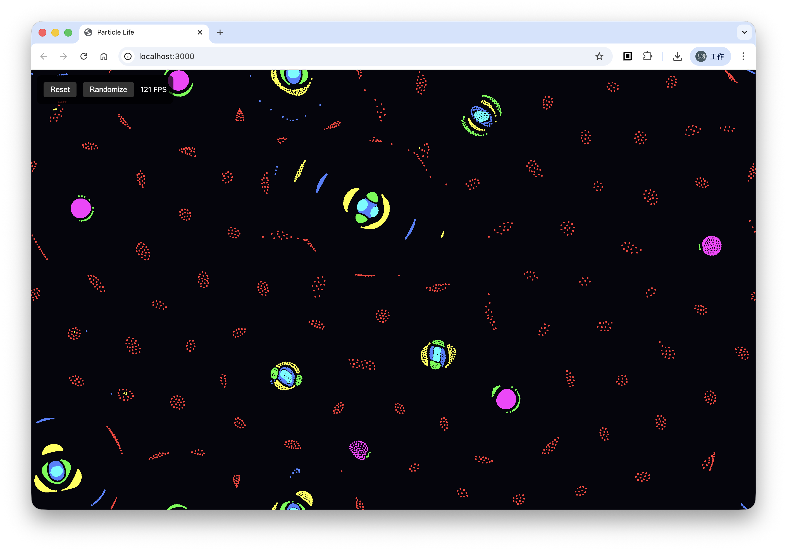

# Particle Life

A WebGPU-powered particle life simulation that demonstrates emergent behavior from simple rules.

**[Live Demo → life.hzy.im](https://life.hzy.im)**



## What is Particle Life?

Particle Life is an artificial life simulation where particles of different colors attract or repel each other based on a random interaction matrix. Despite the simple rules, complex life-like patterns emerge — cells, organisms, and even predator-prey dynamics.

## Features

- 8000 particles with 6 color types
- GPU-accelerated physics using WebGPU compute shaders
- Toroidal space (particles wrap around edges)
- Real-time FPS counter
- Randomize rules to discover new behaviors

## Usage

Open `index.html` in a WebGPU-compatible browser (Chrome 113+, Edge 113+).

Or serve locally:

```bash
npx serve .
```

### Controls

- **Reset** - Randomize particle positions
- **Randomize** - Generate new attraction rules

## How It Works

Each particle type has attraction/repulsion values toward other types:

- Positive value → attraction
- Negative value → repulsion
- Close range → always repel (prevents overlap)
- Medium range → attract/repel based on matrix
- Far range → no interaction

## Browser Support

Requires WebGPU support:
- Chrome 113+
- Edge 113+
- Firefox (behind flag)
- Safari 18+ (macOS Sequoia)

## License

MIT
